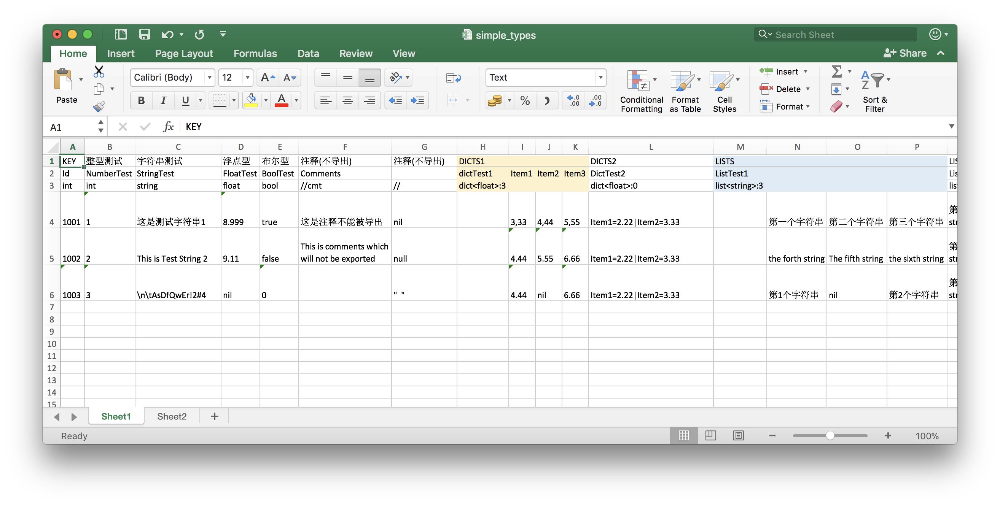

# excelizor

A simple tool that can be used to export .xlsx files to lua-table, json and their corresponding csharp classes and golang structs

excelizor 是一个简易的，用于将 .xlsx 文件导出为 lua-table、json 及其对应的 c# 类和 golang 结构体的工具

[](https://travis-ci.org/sNaticY/excelizor) 
[](https://goreportcard.com/report/github.com/sNaticY/excelizor) 
[](https://github.com/sNaticY/excelizor/releases)
[](https://github.com/sNaticY/excelizor/blob/master/LICENSE)

## Installation | 安装

```bash
$ go get https://github.com/sNaticY/excelizor
```

or you could download release version directly at [Release Page](https://github.com/sNaticY/excelizor/releases)

或直接前往 [Release页面](https://github.com/sNaticY/excelizor/releases) 下载

## Usage | 使用方法

``` Text
Usage: excelizor -p <path> [-lua=<luaExportPath>] [-json=<jsonExportPath>] [-csharp=<csharpExportPath>] [-golang=<golangExportPath>] [-tag=<tag>]
  -csharp string
    	path to place exported .cs class files, export no .cs files if parameter is missing
  -golang string
    	path to place exported .go struct files, export no .go files if parameter is missing
  -json string
    	path to place exported .json files, export no .json files if parameter is missing
  -lua string
    	path to place exported .lua files, export no .lua files if parameter is missing
  -p path
    	[Required] Relative path of excel files folder
  -tag string
        only field with this tag or empty string will be exported
```

## Excel Content Format | Excel 内容格式



### Sheet

Only the first sheet in .xlsx file will be export 

只有 .xlsx 的第一份表将会被导出，其默认名称为 "Sheet1"，命名为 "Vertical" 将会开启特殊的纵向表解析功能

> Default name in excel is "Sheet1", or you could give a special name "Vertical"

### Head & Key | 表头与键

The first 4 rows in your excel is Head

每个表格的前四行定义为表头

1. First row is descriptions of each field, It will not be exported at all so you can fill it with everything you want.   
2. Second row is name of each field. 
3. Third row is type of each field. [int, float, string, bool, dict, list]
4. Forth row is tag of each field, same tag with arguments and empty tag will always be exported.

The first field must be "Id-int" as a key of every row

1. 第一行是每一个对应字段的描述，该行的任何数据都不会被导出，因此可任意填写(一般是一个中文注释。。。)
2. 第二行是字段名称
3. 第三行是字段类型，如[int, float, string, bool, dict, list]等
4. 第四行为对应字段的标签，仅当该值与导出时 -tag 参数一致或留空的字段会被导出

第一个字段目前仅支持 "Id-int" 作为每一行数据的 key

### Basic Type | 基本类型

* int: `int32` in golang and `int` in csharp
* string: is `string`
* float: `float32` in golang and `float` in csharp
* bool: is `bool`. [true, T, 1, TRUE] is `true` and [false, F, 0, FALSE] is `false`
* comment: any string in type-row start with `//` is commet, that field in each row will be ignored


* int: 对应 golang 的`int32`和 c# 中的`int`
* string: 就是普通的`string`
* float: 对应 golang 的`float32`和 c# 中的`float`
* bool: 对应`bool`，可填写[true, T, 1, TRUE]代表`ture`，[false, F, 0, FALSE]代表`false`
* comment: 任何一个字段的类型以`//`开头将会在导出时被忽略

Excel

|      | 整型       | 字符串            | 浮点      | 布尔     | 注释(不导出)       |
| ---- | ---------- | ---------------- | --------- | -------- | ----------------- |
| Id   | NumberTest | StringTest       | FloatTest | BoolTest | can be empty      |
| Int  | int        | string           | float     | bool     | //comment         |
|      |            |                  | client    | server   |                   |
| 1001 | 345        | This is a string | 2,6       | true     | won't be exported |
| 1002 | nil        | nil              | nil       | nil      | nil               |

Export Json (-tag with "client"), so the field `bool BoolTest = true/false` will be ignored, but `float FloatTest = 2.6` will be included

导出 Json 时添加 -tag=client 参数，因此该表中`bool BoolTest = true/false` 将会被忽略，而`float FloatTest = 2.6`会被导出

``` json
[ 
    { 
        "Id": 1001,
        "NumberTest": 345,
        "StringTest": "This is a string",
        "FloatTest": 2.600,
        "BoolTest": true
    },
    { 
        "Id": 1002
    }
]
```

Export Lua(-tag with 'server"'), so the field `bool BoolTest = true/false` will be included, `float FloatTest = 2.6` will be ignored

导出 Lua 时添加 -tag=server 参数，因此该表中`bool BoolTest = true/false` 将会被导出，而`float FloatTest = 2.6`会被忽略

``` lua
local BasicTypes = {
    [1001] = {
        Id = 1001,
        NumberTest = 345,
        StringTest = "This is a string",
        BoolTest = true,
    },
    [1002] = {
        Id = 1002,
    },
}

return BasicTypes
```

Export csharp class (with no tag), so all the fields with tag "client" and "server" will be ignored

导出 c# 不添加 tag 参数，因此标签为 "client" 或 "server" 的字段都会被忽略

``` csharp
using System.Collections.Generic;

namespace Configs
{
    public class BasicTypes 
    {
        public int Id;
        public int NumberTest;
        public string StringTest;
    }
}
```

Export golang struct

``` go
package exports

type BasicTypes struct {
	Id int32 `json:"Id"`
	NumberTest int32 `json:"NumberTest"`
	StringTest string `json:"StringTest"`
}
```

### Nested Type | 嵌套类型

* list<T>:δ  `List<T>` in csharp and `[]T` in golang
* dict<T>:δ  `Dictionary<string, T>` in csharp and `map[string]T` in golang

> T is any Type such as `float` or `int`,  δ is count of column which it cost in table, can be [0, +∞)], When δ == 0, the number of elements in the structure can be arbitrary and seperated with "|", otherwise, the maximum number of elements can not exceed the delta, only one element in every single cell.
	
* list<T>:δ  对应 c# 的`List<T>`以及 golang 中的`[]T` 
* dict<T>:δ  对应 c# 的`Dictionary<string, T>`以及 golang 中的`map[string]T`

> T 代表某个类型如`float`或`int`，δ 代表该字段占用的后续列数且 δ >= 0，当 δ == 0 时，该 list 或 dict 中元素的个数将不受数量限制，且使用 "|" 分隔，当 δ > 0 时，该 list 或 dict 中元素的数量将不得大于 δ，每个单元格中填写一个元素

Excel

|      | Spread Dictionary |       |       |       | Fold Dictionary      | Spread List   |      |      |      | Fold List     |
| ---- | ----------------- | ----- | ----- | ----- | -------------------- | ------------- | ---- | ---- | ---- | ------------- |
| Id   | dictTest1         | Item1 | Item2 | Item3 | DictTest2            | ListTest1     |      |      |      | ListTest2     |
| int  | `dict<float>:3`   |       |       |       | `dict<int>:0`        | `list<int>:3` |      |      |      | `list<float>:0` |
|      |                   |       |       |       |                      |               |      |      |      |               |
| 2002 |                   | 4.44  | 5.55  | 6.66  | Item1=10 \| Item2=11 |               | 123  | 124  | 125  | 0.2\|0.4\|0.6 |
| 2003 |                   | 4.44  | nil   | 6.66  | nil                  | nil           |      |      |      | 1.3\|1.5\|1.7 |

Export Json

```json
[ 
    { 
        "Id": 2002, 
        "DictTest1": { 
            "Item1": 4.440,
            "Item2": 5.550,
            "Item3": 6.660 
        }, 
        "DictTest2": { 
            "Item1": 10,
            "Item2": 11 
        },
        "ListTest1": [ 
            123,
            124,
            125
        ],
        "ListTest2": [ 
            0.200,
            0.400,
            0.600
        ]
    },
    { 
        "Id": 2003, 
        "DictTest1": { 
            "Item1": 4.440,
            "Item3": 6.660 
        },
        "ListTest2": [ 
            1.300,
            1.500,
            1.700
        ]
    }
]
```

Export lua

```lua
local NestedTypes = {
    [2002] = {
        Id = 2002, 
        DictTest1 = {
            Item1 = 4.440,
            Item2 = 5.550,
            Item3 = 6.660, 
        }, 
        DictTest2 = {
            Item1 = 10,
            Item2 = 11, 
        },
        ListTest1 = {
            [0] = 123,
            [1] = 124,
            [2] = 125,
        },
        ListTest2 = {
            [0] = 0.200,
            [1] = 0.400,
            [2] = 0.600,
        },
    },
    [2003] = {
        Id = 2003, 
        DictTest1 = {
            Item1 = 4.440,
            Item3 = 6.660, 
        },
        ListTest2 = {
            [0] = 1.300,
            [1] = 1.500,
            [2] = 1.700,
        },
    },
}

return NestedTypes
```

Export csharp class

```csharp
using System.Collections.Generic;

namespace Configs
{
    public class NestedTypes 
    {
        public int Id;
        public Dictionary<string, float> DictTest1;
        public Dictionary<string, int> DictTest2;
        public List<int> ListTest1;
        public List<float> ListTest2;
    }
}
```

Export golang struct

```go
package exports

type NestedTypes struct {
	Id int32 `json:"Id"`
	DictTest1 map[string]float32 `json:"DictTest1"`
	DictTest2 map[string]int32 `json:"DictTest2"`
	ListTest1 []int32 `json:"ListTest1"`
	ListTest2 []float32 `json:"ListTest2"`
}
```

### Multi-nested Type | 多重嵌套结构

* list<ANY_TYPE_OR_NESTED_TYPE>:δ such as list<dict<string>:0>:5
* dict<ANY_TYPE_OR_NESTED_TYPE>:δ such as dict<list<dict<float>:0>:2>:3

> **MOST OF LOGIC IS EXACTLY THE SAME AS BEFORE. HARD TO EXPLAIN, LET'S SEE SOME EXAMPLES**
	
* list<ANY_TYPE_OR_NESTED_TYPE>:δ 例如 list<dict<string>:0>:5
* dict<ANY_TYPE_OR_NESTED_TYPE>:δ 例如 dict<list<dict<float>:0>:2>:3

> **表格填写逻辑与之前完全相同，很难描述，大家直接看示例即可** 好吧其实是英文不好描述不出来，大概就是一个嵌套的结构使用"{"和"}"括起来再使用"|"分隔就好

Excel

| KEY  | DICTINDICT1           |          |       |       |          |       |       |
| ---- | --------------------- | -------- | ----- | ----- | -------- | ----- | ----- |
| Id   | DictTest3             | SubDict1 | Item1 | Item2 | SubDict2 | Item1 | Item2 |
| int  | `dict<dict<int>:2>:2` |          |       |       |          |       |       |
|      |                       |          |       |       |          |       |       |
| 3001 |                       |          | 3111  | 3112  |          | 3121  | 3122  |
| 3002 |                       | nil      |       |       |          | 3221  | 3222  |

| DICTINDICT2             |                                 |                      | DICTINDICT3                              |
| ----------------------- | ------------------------------- | -------------------- | ---------------------------------------- |
| DictTest4               | SubDict1                        | SubDict2             | DictTest5                                |
| `dict<dict<float>:0>:2` |                                 |                      | `dict<dict<string>:0>:0`                 |
|                         |                                 |                      |                                          |
|                         | it1=31.11\|it2=31.12\|it3=31.13 | it1=31.21\|it2=31.22 | Subdict1={item1=asd\|item2=sdf}\|Subdict2={item1=qwe\|item2=wer} |
| nil                     |                                 |                      | nil                                      |

Export Json

``` json
[ 
    { 
        "Id": 3001, 
        "DictTest3": {  
            "SubDict1": { 
                "Item1": 3111,
                "Item2": 3112 
            }, 
            "SubDict2": { 
                "Item1": 3121,
                "Item2": 3122 
            } 
        }, 
        "DictTest4": {  
            "SubDict1": { 
                "It1": 31.110,
                "It2": 31.120,
                "It3": 31.130 
            }, 
            "SubDict2": { 
                "It1": 31.210,
                "It2": 31.220 
            } 
        }, 
        "DictTest5": {  
            "Subdict1": { 
                "Item1": "asd",
                "Item2": "sdf" 
            }, 
            "Subdict2": { 
                "Item1": "qwe",
                "Item2": "wer" 
            } 
        }
...

```

Export lua

```lua
local MultiNestedTypes = {
    [3001] = {
        Id = 3001, 
        DictTest3 = { 
            SubDict1 = {
                Item1 = 3111,
                Item2 = 3112, 
            }, 
            SubDict2 = {
                Item1 = 3121,
                Item2 = 3122, 
            }, 
        }, 
        DictTest4 = { 
            SubDict1 = {
                It1 = 31.110,
                It2 = 31.120,
                It3 = 31.130, 
            }, 
            SubDict2 = {
                It1 = 31.210,
                It2 = 31.220, 
            }, 
        }, 
        DictTest5 = { 
            Subdict1 = {
                Item1 = "asd",
                Item2 = "sdf", 
            }, 
            Subdict2 = {
                Item1 = "qwe",
                Item2 = "wer", 
            }, 
        },
...
```

Export csharp class

```csharp
using System.Collections.Generic;

namespace Configs
{
    public class MultiNestedTypes 
    {
        public int Id;
        public Dictionary<string, Dictionary<string, int>> DictTest3;
        public Dictionary<string, Dictionary<string, float>> DictTest4;
        public Dictionary<string, Dictionary<string, string>> DictTest5;
...
```

Export golang struct

```go
package exports

type MultiNestedTypes struct {
	Id int32 `json:"Id"`
	DictTest3 map[string]map[string]int32 `json:"DictTest3"`
	DictTest4 map[string]map[string]float32 `json:"DictTest4"`
	DictTest5 map[string]map[string]string `json:"DictTest5"`
...
```

> **FOR MORE EXAMPLES, PLEASE CHECK `excels/nested_types.xlsx` AND `exports/nested_types.*`** 

> 欲查看更多示例，请直接打开 `excels/nested_types.xlsx` 和 `exports/nested_types.*`**

## Other Features | 其他特性

### Customizable templates | 可自定义模板

All of exporting features are based on [go-template](https://golang.org/pkg/text/template/), so you can edit `templates/*.tmpl` to do anything you want

导出功能基于 [go-template](https://golang.org/pkg/text/template/)，因此直接修改 `templates/*.tmpl` 即可任意修饰导出文件

* csharp namespace | c# 命名空间
* csharp class inherit some base class | 继承某父类
* golang package name | golang 包名
* ...

### Auto convert file name | 自动转换文件名

We recommand your excel name is `full_lowercase_letters.xlsx`. When exporting csharp class file, it will auto convert your file name to `CamelFileName.cs` to adapt csharp code style. Exporting other files is not affected. 

当文件名为“全小写+下划线分割”式时，导出的 .cs 文件的文件名将会自动转换为驼峰式，其他文件名则保持不变

All the class or struct name, even lua table name will also be `CamelFileName`

导出的 c# 类和 lua-table 表名以及 golang 结构体名都会自动转换为驼峰式

### Auto convert field name | 自动转换字段名称

In csharp class and golang struct, public field should start with a capital letter. If you start with lowercase letter, we will automatically convert to capital letters for you

在 c# 和 golang 中 public 字段名称首字母通常为大写，故字段首字母小写时将自动转换为大写

### Vertical sheet | 纵向表

Sometimes you have only few rows in a sheet but many fields, it will be much easier to transpose your sheet. So we support vertical sheet.

某些情况下一个表格只有很少的几列却有很多字段，通常进行转置操作后会更容易管理，因此纵向表的功能是被支持的。

|      | 整型         | 字符串              | 浮点        | 布尔        | 布尔        | 布尔        | ...            |
| ---- | ---------- | ---------------- | --------- | --------- | --------- | --------- | -------------- |
| Id   | NumberTest | StringTest       | FloatTest | BoolTest1 | BoolTest2 | BoolTest3 | 4,5,6,7,8,9,10 |
| int  | int        | string           | float     | bool      | bool      | bool      | ,,,            |
|      |            |                  |           |           |           |           |                |
| 1001 | 345        | This is a string | 2.6       | true      | false     | true      | ,,,            |

Edit your sheet name (default is "Sheet1") to "Vertical" and then you can fill your cell like this

将表名 (默认为"Sheet1") 修改为 "Vertical" 后按照以下方式填写表格后，

|      | Id         | int    |      | 1001             |
| ---- | ---------- | ------ | ---- | ---------------- |
| 整型   | NumberTest | int    |      | 345              |
| 字符串  | StringTest | string |      | This is a string |
| 浮点   | FloatTest  | float  |      | 2.6              |
| 布尔   | BoolTest1  | bool   |      | true             |
| 布尔   | BoolTest2  | bool   |      | false            |
| 布尔   | BoolTest3  | bool   |      | true             |
| 布尔   | BoolTest4  | bool   |      | false            |
| 布尔   | BoolTest5  | bool   |      | true             |
| 布尔   | BoolTest6  | bool   |      | false            |
| 布尔   | BoolTest7  | bool   |      | true             |
| 布尔   | BoolTest8  | bool   |      | false            |
| 布尔   | BoolTest9  | bool   |      | true             |
| 布尔   | BoolTest10 | bool   |      | false            |

Then everyhing still works well.

直接导出即可。

### Type check | 类型检查

That is a basic feature. We will check if the value is valid for the type, so if you fill `2..2`in a float cell, we will tell you.

这只是基础功能，任何字段的值导出前都会进行检查以确认是否可以正确解析。如果在一个 float 字段中填写了 "2..2"，将会直接报错

### Comment row | 注释行

If it is not enough for you to only use comment column ( field type start with "//" ) , You can insert a row which id start with "//". Everything in this row will be ignored.

如果注释列的功能(以"//"起始的字段将被忽略)还不够的话，可以插入以"//"为id起始的一行，该行在导出时会被忽略。 

|        | 整型           | 字符串            | 浮点      | 布尔     | 注释(不导出)       |
| ------ | -------------- | ---------------- | --------- | -------- | ----------------- |
| Id     | NumberTest     | StringTest       | FloatTest | BoolTest | can be empty      |
| Int    | int            | string           | float     | bool     | //comment         |
|  |  |  |  |  |  |
| 1001   | 345            | This is a string | 2,6       | true     | won't be exported |
| //1002 | ok, I can fill | everything       | because   | this row | will be ignored   |

## Contributing

If you are interested in contributing to the excelizor project, please make a PR.

如果你对本项目感兴趣可以随时 pull request

## License

This project is licensed under the MIT License.

License can be found [here](https://github.com/sNaticY/excelizor/blob/master/LICENSE).

